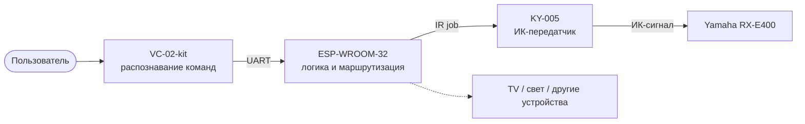
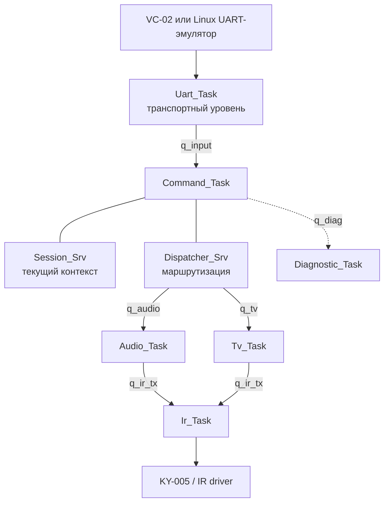

<div align="center">

# Voice Controller

### Универсальный голосовой контроллер для управления бытовой электроникой

Голосовые команды → ESP32 → маршрутизация → ИК / другие исполнительные каналы

<p>
  
  
  
  
  
  
</p>

</div>

## О проекте

**Voice Controller** — модульная платформа, которая преобразует голосовые команды в действия исполнительных устройств.

Первый практический сценарий проекта — управление музыкальным центром **Yamaha RX-E400** через инфракрасный передатчик **KY-005**. В дальнейшем к системе можно добавлять телевизоры, освещение, шторы и другие устройства без изменения голосового модуля.

Ключевая идея — разделить распознавание голоса, прикладную логику и физическое управление:



## Текущий статус

| Направление | Состояние |
|---|---|
| PlatformIO-проект | ✅ Инициализирован |
| Плата | ✅ `esp32dev` / ESP32 Dev Module |
| Framework | ✅ Arduino-ESP32 |
| Проверочная компиляция | ✅ Выполнена успешно |
| RTOS-архитектура | ✅ Согласована |
| UART-эмулятор VC-02 | ⏳ По плану |
| ИК-управление Yamaha | ⏳ По плану |
| Подключение настоящего VC-02 | ⏳ Этап 2 |

Проект находится в активной разработке. Каркас прикладных каталогов и файлов создан, функциональная реализация модулей ещё не начата.

## Аппаратная часть

| Компонент | Назначение |
|---|---|
| **VC-02-kit** | Распознавание заранее настроенных голосовых команд |
| **ESP-WROOM-32** | Центральный контроллер и выполнение прикладной логики |
| **KY-005** | Передача ИК-команд |
| **Yamaha RX-E400** | Первое исполнительное устройство |
| Linux Mint | Разработка и эмуляция VC-02 через UART |

### Цепочка управления Yamaha

```text
Голосовая команда
      ↓
VC-02: «следующий трек» → commandId
      ↓ UART
ESP32: парсинг и маршрутизация → AUDIO / NEXT
      ↓
Yamaha_RxE400_Profile: логическая команда → ИК-код
      ↓
KY-005: модулированный ИК-сигнал
      ↓
Музыкальный центр Yamaha RX-E400
```

Система не рассчитывает на подтверждение выполнения от Yamaha. Событие `IR_SENT` означает, что ESP32 завершила локальную передачу ИК-сигнала; оно не подтверждает, что музыкальный центр включился или сменил трек.

## Архитектура программного обеспечения

Прошивка строится на C++17, Arduino-ESP32 и API FreeRTOS.



### Принципы

- голосовой модуль знает только таблицу «фраза → идентификатор»;
- ESP32 отвечает за сессию, маршрутизацию и профили устройств;
- каждая доменная область получает собственную задачу и очередь;
- `Ir_Task` — единственный владелец ИК-библиотеки и KY-005;
- транспортный уровень не знает об ИК-протоколах;
- доменные задачи не обращаются напрямую к чужому состоянию;
- штатный планировщик FreeRTOS используется без преждевременной привязки задач к ядрам;
- обратный канал VC-02 не является обязательной зависимостью;
- статусы конечных устройств не объявляются подтверждёнными без реального feedback-канала.

### Модель команды

Голосовая команда преобразуется в универсальную логическую команду, а не в прямое управление GPIO или ИК-код:

| Цель | Команда | Действие |
|---|---|---|
| `AUDIO` | `POWER` | Включить / выключить Yamaha |
| `AUDIO` | `PLAY` | Запустить воспроизведение |
| `AUDIO` | `STOP` | Остановить воспроизведение |
| `AUDIO` | `NEXT` | Следующий трек |
| `AUDIO` | `VOLUME_UP` | Увеличить громкость |
| `TV` | `POWER` | Передать команду профилю телевизора |

Такой подход позволяет добавлять устройства независимо друг от друга. Если пользователь говорит «включи телевизор», диспетчер выбирает контекст `TV`; команда «сделай громче» может использовать текущий активный контекст.

## Этапы разработки

### Этап 1 — UART и ИК-канал

1. Linux-скрипт имитирует VC-02-kit.
2. ESP32 принимает и разбирает командный кадр.
3. `Command_Task` маршрутизирует команду в `Audio_Task`.
4. Профиль Yamaha преобразует действие в ИК-задание.
5. `Ir_Task` передаёт команду через KY-005.
6. Проверяется реакция Yamaha RX-E400.

Физическая кнопка в целевую архитектуру не входит.

### Этап 2 — настоящий VC-02-kit

После проверки UART и ИК-канала Linux-эмулятор заменяется настоящим VC-02-kit. Прикладная логика ESP32 при этом не должна изменяться.

### Этап 3 — расширение экосистемы

Планируется добавление:

- телевизора с отдельным профилем и доменной задачей;
- дополнительных ИК-каналов;
- сетевых источников команд;
- MQTT / HTTP-интеграции;
- сценариев последовательных действий;
- хранения конфигурации в NVS.

## Структура репозитория

```text
Voice_Controller/
├── platformio.ini             # конфигурация PlatformIO
├── README.md                  # быстрый вход в проект
├── readme/
│   ├── REPORT.md              # подробный технический отчёт
│   ├── PLAN.md                # план работ с чекбоксами
│   └── NEXT_SESSION.md        # правила работы и точка продолжения
├── APP/                       # прикладная архитектура и исходники
│   ├── Main/
│   ├── Core/
│   ├── Drivers/
│   ├── Services/
│   ├── Devices/
│   └── Tasks/
└── tools/
    └── vc02_emulator/         # Linux-эмулятор голосового модуля
```

Модули приложения используют раздельные каталоги:

```text
<module>/inc/   # публичные заголовочные файлы
<module>/src/   # реализации
```

`platformio.ini` настроен с параметром `src_dir = APP`, поэтому прикладные исходники собираются непосредственно из `APP`. Корневые каталоги `src`, `include`, `lib` и `test` для этой структуры не используются.

## Быстрый старт

### Требования

- Linux Mint или другой Linux-дистрибутив;
- VS Code с PlatformIO;
- плата ESP32 DevKit V1;
- установленный USB-UART / USB-драйвер платы;
- Arduino-ESP32 через PlatformIO.

### Сборка

Из корня репозитория:

```bash
pio run -e esp32dev
```

### Прошивка и монитор порта

```bash
pio run -e esp32dev -t upload
pio device monitor -b 115200
```

Порт можно указать явно через параметр `upload_port` или `monitor_port` в `platformio.ini`.

## Безопасность подключения KY-005

Перед подключением необходимо проверить конкретную ревизию модуля:

- наличие встроенного транзисторного драйвера;
- наличие токоограничивающего резистора;
- рабочее напряжение ИК-светодиода;
- распиновку `VCC`, `GND` и `SIG`.

Питание KY-005 от отдельной линии 5 В допустимо только при гарантии, что 5 В не попадут на GPIO ESP32. Сигнальная линия ESP32 должна соответствовать допустимым уровням микроконтроллера; при необходимости используется рекомендованная схема с внешним транзистором.

Подробное рассмотрение ИК-сигналов, библиотек и схем подключения находится в [REPORT.md](readme/REPORT.md).

## Документация

- [Технический отчёт](readme/REPORT.md) — концепция, ИК-канал, протоколы и архитектурные решения.
- [План работ](readme/PLAN.md) — последовательность задач и критерии завершения.
- [Быстрый вход](readme/NEXT_SESSION.md) — правила взаимодействия и точка возобновления работы.

## Принципы разработки

Проект развивается как набор независимых модулей и слоёв. Сначала согласуются интерфейсы и ответственность компонентов, затем реализуется код и выполняется проверка на следующем уровне системы.

Основной режим работы — совместная разработка: архитектурные решения обсуждаются заранее, пользователь самостоятельно вносит изменения в проект, после чего выполняется аудит результата.

---

<div align="center">

**Voice Controller** · modular voice control for real-world devices

</div>
